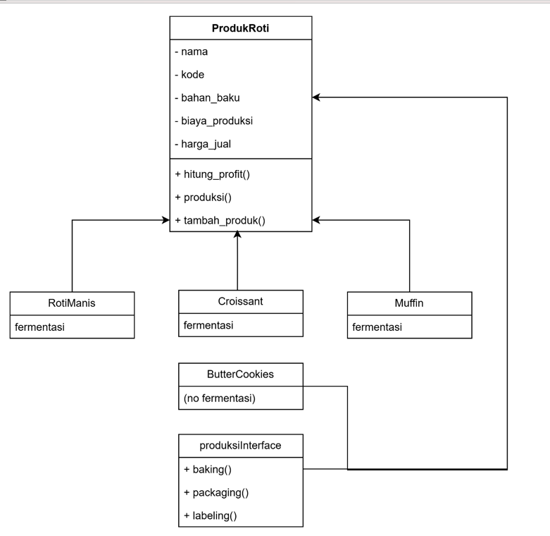

# UAS-PBO-KELOMPOK3
Tugas UAS Kelompok 3 PBO
Nama Anggota : 
1. Fatih Nur Faiq
2. Umar Adiwinata
3. Muhammad Raihan Faza

# Hanari Bakery - Sistem Produksi dan Manajemen Produk Roti
Program ini dibuat sebagai proyek kolaborasi untuk memenuhi tugas UAS PBO 2025 dengan menerapkan prinsip SOLID dalam pengembangan perangkat lunak menggunakan Python.

# Fitur
- Tambah dan tampilkan produk roti
- Simulasi proses produksi (pengadonan, pemanggangan, topping)
- Kalkulasi estimasi profit per produk
- Struktur modular dan fleksibel untuk pengembangan

# Struktur Folder
hanari_bakery/
├── main.py
├── models/
├── interfaces/
├── services/
├── utils/

# Konsep OOP & SOLID
- Abstraction : Class `ProdukRoti` sebagai abstraksi umum
- Inheritance : Subclass roti (roti manis, croissant, muffin, cookies)
- Interface Segregation : Interface untuk proses produksi
- Open-Closed Principle : Mudah menambah produk baru
- Single Responsibility : Setiap class hanya memiliki satu tanggung jawab

# Screenshot output yang dihasilkan ketika program dijalankan

# Link GitHub
[https://github.com/UmarAdiwinata/UAS-PBO-KELOMPOK3]                                   ]

# Pembagian tugas anggota team
- Anggota 1: Struktur Class & Interface (UMAR)
- Anggota 2: Simulasi Produksi & Profit README.MD (FATIH)
- Anggota 3: Menu Program,Testing & README.MD     (RAIHAN)

